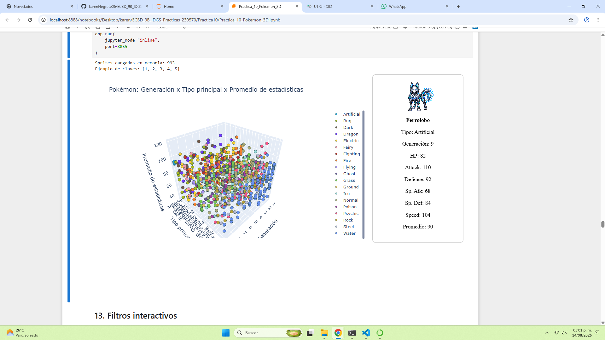
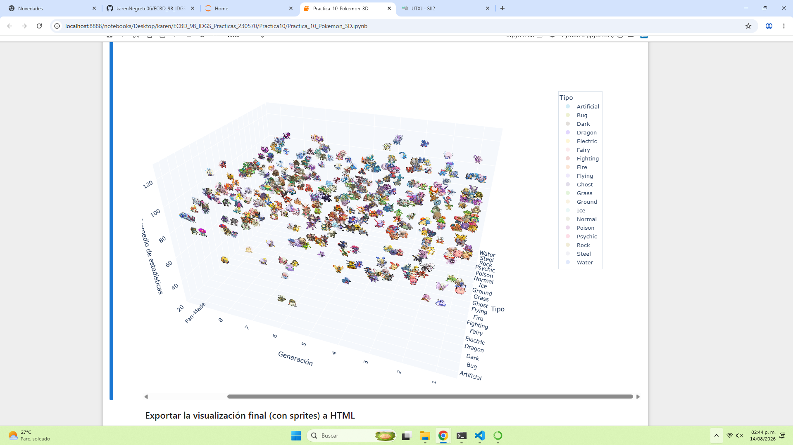
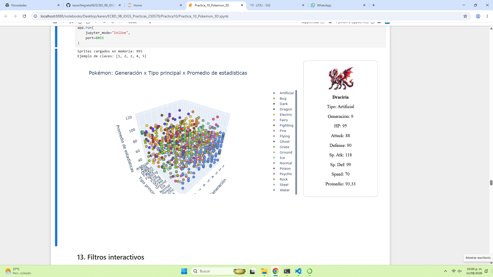

# Práctica 10 --- Pokémon: Scatter 3D Plot con Sprites

## Descripción

En esta práctica se construyó un dataset de Pokémon de las generaciones
1 a 9 y se realizó un análisis y visualización de sus características
mediante un **gráfico de dispersión 3D (Scatter 3D)**.

El trabajo se desarrolló en **Python y Jupyter Notebook**, utilizando
datos obtenidos desde la **PokeAPI**. Además del dataset original, se
incorporaron cinco Pokémon personalizados creados para la práctica,
incluyendo sus estadísticas y sprites.

> **Nota:** La ejecución completa del notebook puede ser pesada debido a
> la descarga de datos y sprites. Por esta razón, la evidencia de la
> práctica se conserva mediante capturas del resultado final y de los
> Pokémon personalizados.

------------------------------------------------------------------------

## Datos de la práctica

-   **Práctica:** 10
-   **Tema:** Pokémon --- Scatter 3D Plot con Sprites
-   **Asignatura:** Extracción de Conocimiento en Bases de Datos
-   **Programa:** Ingeniería en Desarrollo y Gestión de Software
-   **Periodo:** Mayo - Agosto 2026
-   **Estudiante:** Karen Lizbeth Negrete Hernández
-   **Matrícula:** 230570
-   **Grupo:** 9° B IDGS
-   **Fecha de entrega:** 15 de agosto de 2026

------------------------------------------------------------------------

## Objetivo

Construir un dataset de Pokémon de las generaciones 1 a 9 a partir de la
PokeAPI y utilizarlo para generar una visualización tridimensional donde
se puedan analizar:

-   La generación del Pokémon.
-   Su tipo principal.
-   El promedio de sus estadísticas base.
-   Su sprite como representación visual.

El gráfico utiliza:

  Elemento   Variable
  ---------- --------------------------
  Eje X      Generación
  Eje Y      Tipo principal
  Eje Z      Promedio de estadísticas
  Color      Tipo principal
  Sprite     Imagen del Pokémon

------------------------------------------------------------------------

## Tecnologías utilizadas

-   Python
-   Jupyter Notebook
-   Pandas
-   NumPy
-   Requests
-   Matplotlib
-   Plotly
-   Dash
-   Pillow (PIL)
-   tqdm
-   ipywidgets
-   PokeAPI

------------------------------------------------------------------------

## Obtención de los datos

Los datos principales se obtuvieron mediante la PokeAPI.

Primero se consultaron las generaciones 1 a 9 para asociar cada Pokémon
con su generación. Después se consultaron los datos de los Pokémon para
obtener:

-   ID
-   Nombre
-   Generación
-   Tipo principal
-   Tipo secundario
-   HP
-   Attack
-   Defense
-   Sp. Atk
-   Sp. Def
-   Speed
-   Estado de legendario/mítico
-   URL del sprite

Las solicitudes de los Pokémon se realizaron en paralelo utilizando
`ThreadPoolExecutor` para reducir el tiempo de descarga.

La ejecución registrada en el notebook obtuvo **1025 Pokémon
correctamente y 0 errores**.

------------------------------------------------------------------------

## Construcción del dataset

El dataset se guardó localmente como:

``` text
pokemon_data/pokemon_dataset.csv
```

También se creó una carpeta para almacenar los sprites:

``` text
pokemon_data/sprites/
```

El dataset contiene las siguientes variables principales:

-   `ID`
-   `Name`
-   `Generation`
-   `Type 1`
-   `Type 2`
-   `HP`
-   `Attack`
-   `Defense`
-   `Sp. Atk`
-   `Sp. Def`
-   `Speed`
-   `Legendary`
-   `Sprite URL`
-   `promedio_estadisticas`

------------------------------------------------------------------------

## Cálculo del promedio de estadísticas

Para comparar las características de los Pokémon se creó la variable:

``` text
promedio_estadisticas
```

Esta se obtiene mediante la media de las seis estadísticas base:

``` text
(HP + Attack + Defense + Sp. Atk + Sp. Def + Speed) / 6
```

Esta variable se utiliza posteriormente como el eje Z del gráfico 3D.

------------------------------------------------------------------------

## Limpieza de datos

Durante el procesamiento se realizaron varias tareas de limpieza:

1.  Normalización de nombres de columnas.
2.  Normalización de los valores de `Type 1` y `Type 2`.
3.  Eliminación de registros duplicados por ID.
4.  Eliminación de registros sin tipo principal.
5.  Conservación de valores nulos en `Type 2`, ya que un Pokémon puede
    tener solamente un tipo.
6.  Revisión de valores nulos antes y después del tratamiento.

En la revisión registrada se encontraron **988 filas** después del
filtrado y limpieza del dataset base, sin registros duplicados por ID.

------------------------------------------------------------------------

## Visualización 3D

Se desarrollaron dos formas principales de visualizar los datos.

### 1. Scatter 3D con Matplotlib

Se creó un gráfico 3D utilizando Matplotlib y se colocaron los sprites
sobre los puntos mediante:

-   `proj3d`
-   `OffsetImage`
-   `AnnotationBbox`

Los sprites se reproyectan y reposicionan cuando se modifica la vista
del gráfico para simular que flotan sobre los puntos 3D.

### 2. Visualización interactiva con Plotly y Dash

Posteriormente se creó una versión interactiva utilizando Plotly y Dash.

Esta versión permite:

-   Rotar el gráfico 3D.
-   Realizar zoom.
-   Filtrar mediante la leyenda de tipos.
-   Pasar el cursor sobre los puntos.
-   Seleccionar un Pokémon.
-   Mostrar su sprite.
-   Mostrar sus estadísticas.
-   Mostrar su generación y promedio de estadísticas.

Los sprites se codificaron en Base64 para poder mostrarlos dentro de la
aplicación.

También se exportó una versión HTML de la visualización:

``` text
pokemon_data/pokemon_scatter3d.html
```

------------------------------------------------------------------------

# Pokémon personalizados

Como parte de la práctica se agregaron cinco Pokémon personalizados a la
visualización.

Todos fueron asignados a la **generación 9** y al tipo principal
**Artificial**.

  -----------------------------------------------------------------------------------------------
       ID Nombre       Tipo              HP   Attack   Defense Sp. Atk Sp. Def   Speed   Promedio
                       secundario                                                      
  ------- ------------ ------------ ------- -------- --------- ------- ------- ------- ----------
     9001 Auricornia   Luminárico        90       75        86     112     108      89      93.33

     9002 Estrelux     Estelar           70       60        72     125     100     123      91.67

     9003 Ferrolobo    Acero             82      110        92      68      84     104      90.00

     9004 Draciria     Fuego             95       88        90     118      99      70      93.33

     9005 Mecanursa    Hielo            110      120       118      65      90      47      91.67
  -----------------------------------------------------------------------------------------------

### Sprites personalizados

Los sprites utilizados fueron:

``` text
pokemon_data/sprites/
├── auricornia.png
├── estrelux.png
├── ferrolobo.png
├── draciria.png
└── mecanursa.png
```

El notebook comprobó que los cinco sprites personalizados fueron
encontrados correctamente.

El resultado registrado fue de **993 Pokémon en el gráfico incluyendo
los Pokémon fan-made**.

------------------------------------------------------------------------

## Pokémon creados

### Auricornia

-   Tipo: Artificial / Luminárico
-   ID: 9001
-   Generación: 9
-   Característica principal: Pokémon unicornio artificial de temática
    luminosa.

### Estrelux

-   Tipo: Artificial / Estelar
-   ID: 9002
-   Generación: 9
-   Característica principal: Pokémon estrella artificial relacionado
    con energía cósmica.

### Ferrolobo

-   Tipo: Artificial / Acero
-   ID: 9003
-   Generación: 9
-   Característica principal: Pokémon lobo artificial con
    características mecánicas.

### Draciria

-   Tipo: Artificial / Fuego
-   ID: 9004
-   Generación: 9
-   Característica principal: Pokémon dragón artificial asociado con
    energía térmica y fuego.

### Mecanursa

-   Tipo: Artificial / Hielo
-   ID: 9005
-   Generación: 9
-   Característica principal: Pokémon oso artificial con armadura y
    temática de hielo.

------------------------------------------------------------------------

## Resultado final

El resultado de la práctica es una visualización 3D interactiva en la
que los Pokémon se distribuyen de acuerdo con:

-   **Generación**
-   **Tipo principal**
-   **Promedio de estadísticas**

Además, la aplicación permite seleccionar un punto y consultar la
información detallada del Pokémon seleccionado.

Para los Pokémon personalizados se integraron sprites propios,
estadísticas personalizadas y tipos secundarios, manteniendo la misma
estructura utilizada por el dataset original.

La evidencia visual de la práctica incluye capturas de:

1.  Los Pokémon personalizados.
2.  Los sprites cargados en la aplicación.
3.  El gráfico 3D.
4.  El panel interactivo con la información de un Pokémon.
5.  El resultado final de la visualización.

------------------------------------------------------------------------

## Estructura principal del proyecto

``` text
Practica_10_Pokemon_3D.ipynb
pokemon_data/
├── pokemon_dataset.csv
├── pokemon_scatter3d.html
└── sprites/
    ├── sprites de Pokémon originales
    ├── auricornia.png
    ├── estrelux.png
    ├── ferrolobo.png
    ├── draciria.png
    └── mecanursa.png
```

------------------------------------------------------------------------

## Conclusión

La práctica permitió aplicar técnicas de **extracción, transformación,
limpieza y visualización de datos** utilizando un dataset real obtenido
mediante una API.

Se logró construir un dataset de Pokémon de las generaciones 1 a 9,
calcular una métrica de promedio de estadísticas y representarla
mediante un gráfico 3D.

También se implementó una visualización interactiva con Plotly y Dash,
permitiendo consultar información individual de cada Pokémon mediante la
selección de puntos.

Finalmente, se amplió el dataset con cinco Pokémon personalizados
---Auricornia, Estrelux, Ferrolobo, Draciria y Mecanursa--- integrando
sus estadísticas, tipos y sprites dentro de la misma visualización.

------------------------------------------------------------------------

## Evidencias

Las evidencias de la práctica se presentan mediante capturas de pantalla
independientes para evitar tener que volver a ejecutar el notebook
completo, debido al tiempo de descarga y procesamiento de los datos y
sprites.

---

## Evidencias de la práctica

A continuación se muestran algunas de las evidencias del resultado final de la práctica.  
Estas capturas corresponden a la visualización 3D con sprites y a la información mostrada para los Pokémon personalizados.

### 1. Ferrolobo en la visualización interactiva

<p align="center">
  
</p>

En esta evidencia se observa a **Ferrolobo**, perteneciente a la generación 9, junto con sus estadísticas y su sprite dentro de la aplicación interactiva.

### 2. Scatter 3D con sprites

<p align="center">
  
</p>

Esta captura muestra la visualización tridimensional completa con los sprites de los Pokémon distribuidos según generación, tipo y promedio de estadísticas.

### 3. Mecanursa en la visualización interactiva

<p align="center">
  
</p>

Se muestra la información de **Mecanursa**, incluyendo su sprite, generación y estadísticas.

### 4. Draciria en la visualización interactiva

<p align="center">
  
</p>

Se muestra la información de **Draciria**, incluyendo su sprite, generación y estadísticas.